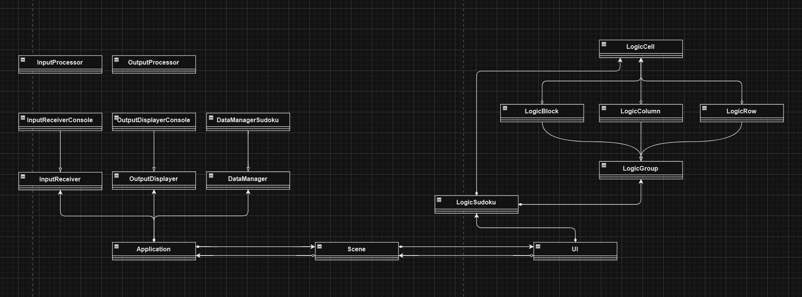

### 项目 UML 示意图



### 项目结构

可运行文件路径：`./cmake-build-debug/final.exe`

项目整体结构：

```
.
│  CMakeLists.txt
│  main.cpp
│
├─cmake-build-debug
│     final.exe
│
├─example
│  └─data
│          20241109163959.dat
│          20241109164010.dat
│          20241109164015.dat
│          20241109164030.dat
│          20241218154600.dat
│          20241218164048.dat
│          notdata.txt
│          
├─include
│  ├─Application
│  │      Application.h
│  │      
│  ├─Data
│  │      DataConfig.h
│  │      DataManager.h
│  │      DataManagerSudoku.h
│  │      
│  ├─Input
│  │      InputErrorHandler.h
│  │      InputMessage.h
│  │      InputProcessor.h
│  │      InputReceiver.h
│  │      InputReceiverConsole.h
│  │      
│  ├─Logic
│  │      LogicBlock.h
│  │      LogicCell.h
│  │      LogicColumn.h
│  │      LogicGroup.h
│  │      LogicRow.h
│  │      LogicSudoku.h
│  │      
│  ├─Output
│  │      OutputDisplayer.h
│  │      OutputDisplayerConsole.h
│  │      OutputProcessor.h
│  │      
│  ├─Scene
│  │      SceGenerator.h
│  │      SceGeneratorArchiveList.h
│  │      SceGeneratorSudokuGame.h
│  │      Scene.h
│  │      
│  ├─UI
│  │      IUI.h
│  │      UContainer.h
│  │      UContainerHorizontal.h
│  │      UContainerVertical.h
│  │      UI.h
│  │      UIArchiveList.h
│  │      UIButton.h
│  │      UIButtonSwitchScene.h
│  │      UIButtonSwitchSceneGenerator.h
│  │      UISudoku.h
│  │      UIText.h
│  │      
│  └─Utils
│          Singleton.h
│          
└─src
    ├─Application
    │      Application.cpp
    │      
    ├─Data
    │      DataConfig.cpp
    │      DataManager.cpp
    │      DataManagerSudoku.cpp
    │      
    ├─Input
    │      InputErrorHandler.cpp
    │      InputMessage.cpp
    │      InputReceiver.cpp
    │      InputReceiverConsole.cpp
    │      
    ├─Logic
    │      LogicBlock.cpp
    │      LogicCell.cpp
    │      LogicColumn.cpp
    │      LogicGroup.cpp
    │      LogicRow.cpp
    │      LogicSudoku.cpp
    │      
    ├─Output
    │      OutputDisplayer.cpp
    │      OutputDisplayerConsole.cpp
    │      
    ├─Scene
    │      SceGenerator.cpp
    │      SceGeneratorArchiveList.cpp
    │      SceGeneratorSudokuGame.cpp
    │      Scene.cpp
    │      
    ├─test
    │      test1.cpp
    │      test2.cpp
    │      test3.cpp
    │      test4.cpp
    │      test5.cpp
    │      test6.cpp
    │      
    └─UI
            IUI.cpp
            UContainer.cpp
            UContainerHorizontal.cpp
            UContainerVertical.cpp
            UI.cpp
            UIArchiveList.cpp
            UIButton.cpp
            UIButtonSwitchScene.cpp
            UIButtonSwitchSceneGenerator.cpp
            UISudoku.cpp
            UIText.cpp
```